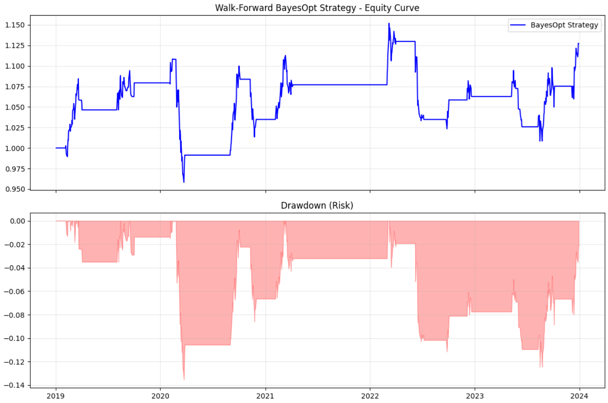

# Robust AI Quant: Adaptive Pairs Trading with Bayesian Optimization 📉🤖

### **Project Overview**
A production-ready quantitative trading engine that implements a Mean Reversion (Pairs Trading) strategy on the XOM/CVX pair.

This project focuses on **Robustness** over raw backtest returns. Instead of using "Grid Search" which overfits to past noise, I implemented a **Rolling Walk-Forward Validation** framework where a **Bayesian Optimizer (Optuna)** adaptive fine-tunes the strategy's parameters (weights, thresholds, and stop-losses) for future data.

The engine successfully navigated the massive volatility of 2020-2021 (the Oil Price War), proving its survival capabilities before generating Alpha in 2023.


*(Fig 1. Walk-Forward Out-of-Sample Performance showing risk-managed recovery after the 2020-21 regime shift.)*

### **The Key Engineering Challenges (The "Fixes")**
This project's primary value lies in identifying and fixing common backtesting biases. I moved from an overfitted, unrealistic script to a professional engine by implementing:

1.  **Looking Out-of-Sample:** Optimized parameters on 12 months of "training" data and tested them on the *next* 3 months of "future" data. If the model fails here, it fails in reality.
2.  **Solving the "Moon Shot": Volatility Targeting.**
    * Early tests showed an unrealistic 14,000% return due to massive leverage on bad data.
    * **Fix:** I implemented industry-standard **Volatility Sizing (targeting 15% annualized vol)**. If the spread is wild, the engine trades smaller. If it's calm, it trades larger. This keeps the risk curve realistic.
3.  **Solving the "Widowmaker Trade": Hard Stop-Losses.**
    * Cointegration often breaks (e.g., COVID). Holding a broken spread results in ruin.
    * **Fix:** I upgraded the backtester to execute a **hard Stop-Loss** if the Z-score exploded (optimized dynamically by the AI). The optimizer "learned" to cut losses during periods of divergence, which is why you see long "flat lines" (holding cash) in the chart during 2021-2022.
4.  **Preventing "Cheating": ADF Stationarity Constraint.**
    * The AI naturally tries to "cheat" by picking a trending spread rather than a mean-reverting one to maximize Sharpe.
    * **Fix:** I added a mandatory **Augmented Dickey-Fuller (ADF)** stationarity check inside the objective function. If the p-value > 0.05, the trial is rejected immediately.

### **Project Architecture**
* **Input:** `yfinance` Data Loader (with outlier filtering).
* **Brain:** Optuna Bayesian Optimizer (TPE Sampler) for higher-dimensional search space.
* **Shield:** Dynamic Stop-Loss and Volatility Sizing logic.
* **Engine:** Stitched Walk-Forward Daily Returns.

### **How to Use**
1.  Install:
    ```bash
    pip install yfinance pandas numpy optuna matplotlib statsmodels
    ```
2.  Ensure `performance_tearsheet.png` is generated.
3.  Run `main.py` to replicate the result.

---
*Created by Vaibhav Panda as a Quant Research project demonstrating professional risk management and advanced optimization.*


